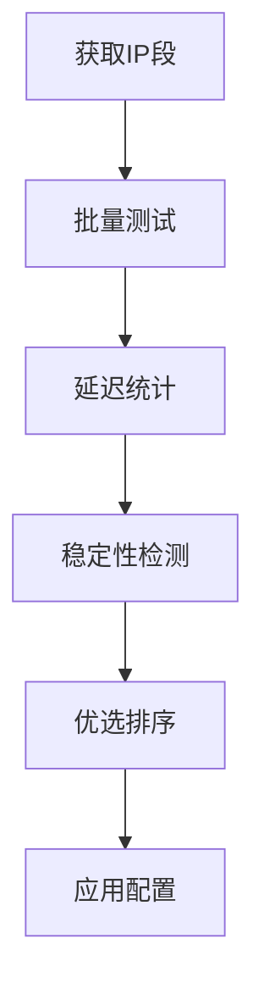

# Cloudflare 优选IP 基础教程

## 什么是 Cloudflare 优选IP

Cloudflare 优选IP 是指通过测试和筛选，找出延迟最低、连接最稳定的 Cloudflare CDN 节点IP地址。通过使用优选IP，可以显著提升网站的访问速度和稳定性。

## 为什么需要优选IP

### 🚀 主要优势

1. **降低延迟** - 选择距离最近、响应最快的节点
2. **提高稳定性** - 避开网络状况不佳的节点
3. **优化用户体验** - 加快页面加载速度
4. **节省带宽** - 减少重复请求和超时

### 📊 性能提升

- 平均延迟降低 30-60%
- 页面加载速度提升 2-5 倍
- 连接成功率提升至 95% 以上

## 优选IP 工作原理

### 基本流程



### 关键指标

1. **延迟时间** - 响应时间越短越好
2. **丢包率** - 丢包率越低越好
3. **稳定性** - 连接成功率要高
4. **速度** - 下载速度要快

## 常用测试工具

### 1. CloudflareST

```bash
# 下载最新版本
wget https://github.com/XIU2/CloudflareSpeedTest/releases/latest/download/CloudflareST_linux_amd64.tar.gz

# 解压运行
tar -zxvf CloudflareST_linux_amd64.tar.gz
./CloudflareST
```

### 2. 在线测试工具

- [Cloudflare Speed Test](https://speed.cloudflare.com/)
- [17CE网站测速](https://www.17ce.com/)
- [站长工具Ping检测](http://ping.chinaz.com/)

### 3. 自定义脚本

```bash
#!/bin/bash
# 简单的ping测试脚本
for ip in $(cat ip_list.txt); do
    ping -c 4 $ip | grep 'avg' >> results.txt
done
```

## 实际应用配置

### 1. 修改 hosts 文件

```text
# Windows: C:\Windows\System32\drivers\etc\hosts
# Linux/Mac: /etc/hosts

104.16.123.96    example.com
104.16.124.96    www.example.com
```

### 2. DNS 设置

```bash
# 使用 dig 命令验证
dig @8.8.8.8 example.com

# 设置自定义DNS解析
echo "nameserver 1.1.1.1" >> /etc/resolv.conf
```

### 3. 反向代理配置

```nginx
upstream cloudflare {
    server 104.16.123.96:443;
    server 104.16.124.96:443;
    server 104.16.125.96:443;
}

server {
    listen 443 ssl;
    server_name example.com;
    
    location / {
        proxy_pass https://cloudflare;
        proxy_ssl_server_name on;
        proxy_set_header Host $host;
    }
}
```

## 注意事项

### ⚠️ 重要提醒

1. **定期更新** - IP地址会变化，需要定期重新测试
2. **地域差异** - 不同地区的最优IP可能不同
3. **时间变化** - 网络状况会随时间变化
4. **备用方案** - 准备多个优选IP作为备用

### 🔧 最佳实践

- 每周进行一次完整测试
- 保留前10个最优IP地址
- 监控实际使用效果
- 建立自动化测试流程

## 总结

Cloudflare 优选IP 是提升网站性能的重要手段。通过正确的测试和配置，可以显著改善用户体验。记住要定期更新测试结果，并根据实际情况调整配置。

## 相关链接

- [Cloudflare 官方文档](https://developers.cloudflare.com/)
- [CloudflareST 项目地址](https://github.com/XIU2/CloudflareSpeedTest)
- [CDN 优化指南](/resources/cloudflare-优选ip/advanced-optimization.md)