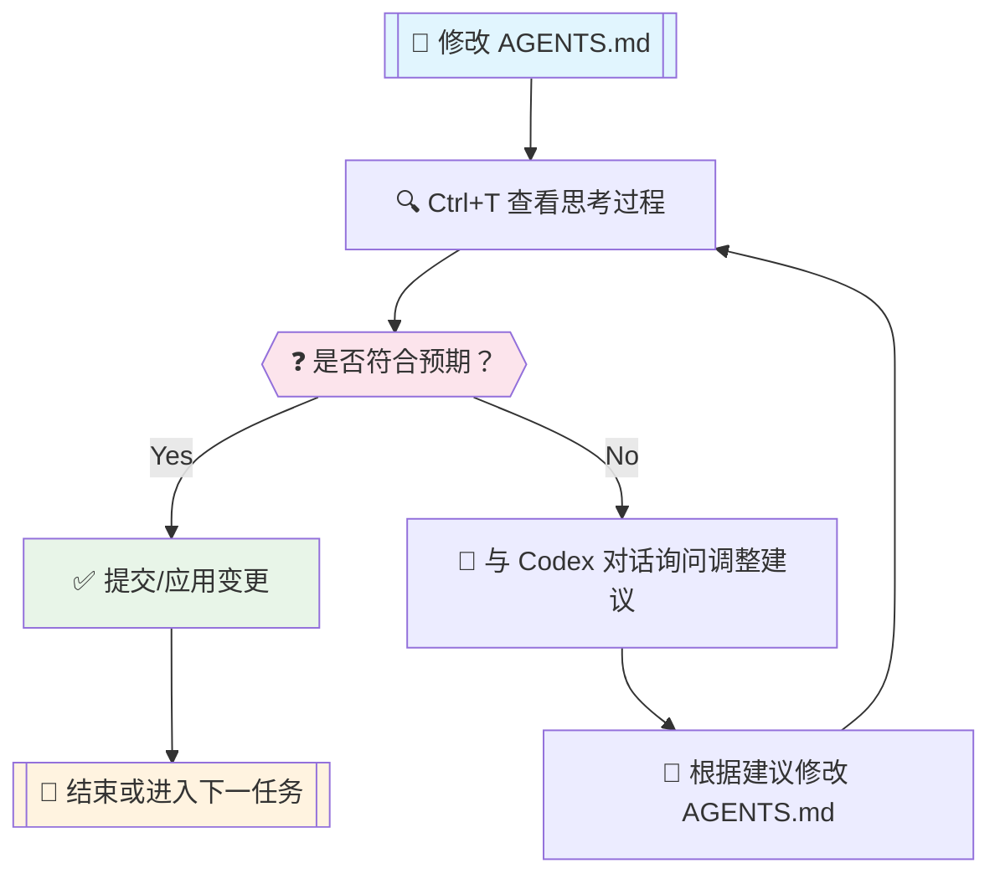

# OpenAI Codex 完整使用指南

::: tip 📖 文档导读
本指南将带你从零开始掌握 OpenAI Codex，涵盖配置、命令、工具调用、实战技巧等各个方面。
:::

## 🔗 官方资源

- 📚 [官方快速开始文档](https://developers.openai.com/codex/quickstart)
- 💻 [GitHub 项目文档](https://github.com/openai/codex/tree/main/docs)

## ⚙️ 基础配置 config.toml

::: warning 配置前必读
工欲善其事，必先利其器。强烈建议先阅读官方配置文档 `config.md` 了解各项配置的详细作用。
:::

在 `~/.codex/config.toml` 文件中进行基础配置：

```toml
# 模型配置
model = "gpt-5-codex"                      # Codex 0.36.0+ 支持
model_reasoning_effort = "high"             # 使用最大推理能力
model_reasoning_summary = "detailed"        # 终端显示详细推理总结 (Ctrl+T查看)
model_verbosity = "high"                   # 高详细度输出
model_supports_reasoning_summaries = true  # 强制启用推理总结

# 代理配置
hide_agent_reasoning = false               # 显示 Agent 内部思考过程

# 隐私配置
disable_response_storage = true            # 禁止 OpenAI 存储对话数据

# 权限配置 (建议通过 /approvals 命令配置)
approval_policy = "never"                  
sandbox_mode = "workspace-write"           

# 网络访问配置
[sandbox_workspace_write]
network_access = true                      # 允许网络访问
```

::: details 配置项详解
- `model_reasoning_effort`: 控制模型推理深度，`high` 提供最佳效果
- `model_reasoning_summary`: 推理总结详细程度，`detailed` 提供完整信息
- `hide_agent_reasoning`: 设为 `false` 可查看更多内部处理过程
- `disable_response_storage`: 重要隐私设置，禁止数据存储
:::

## 🚀 核心命令

::: tip 命令帮助
使用 `codex --help` 查看所有可用命令参数，这是个好习惯！
:::

启动 Codex 后，输入 `/` 可查看所有支持的快捷命令：

### 📊 /status - 状态检查

**最重要的命令**，用于检查：
- 当前权限级别
- GPT-5 模型配置
- API Key 状态

::: warning 特别提醒
使用自定义 API Key 时，务必经常检查确保使用正确的模型配置。
:::

### 🔐 /approvals - 权限管理

Codex 提供三种权限级别：

| 权限级别 | 功能范围 | 适用场景 | 实际体验 |
|---------|---------|---------|----------|
| **Read Only** | 仅读取文件 | 代码审查、学习 | ❌ 限制过多，频繁需要确认 |
| **Auto** | 读写文件、运行命令 | 一般开发 | ⚠️ 仍需较多手动确认 |
| **Full Access** | 完整权限 + 网络访问 | 完整开发流程 | ✅ 真正的自动化体验 |

::: tip 推荐配置
对于日常开发，推荐使用 `Full Access` 模式，可通过启动参数跳过权限确认：

```bash
codex --dangerously-bypass-approvals-and-sandbox
```
:::

::: warning 安全提醒
`Full Access` 模式具有完整系统权限，请确保在可信环境中使用。
:::

### 🔌 /mcp - MCP 服务器配置

::: danger Windows 用户注意
Windows 开发者按照 [mcp_servers 官方文档](https://github.com/openai/codex/blob/main/docs/config.md#mcp_servers) 配置通常会失败！
:::

**常见错误信息：**
```bash
Program not found
# 或
request timed out
```

**Windows 下正确配置方法：**

在原教程基础上添加以下配置：

1. ➕ **新增 `command`** - 指向具体的 npx 位置
2. ➕ **新增 `env`** - 包含 SYSTEMROOT 环境变量

```toml
[mcp_servers.context7]
command = "C:\\Program Files\\nodejs\\npx.cmd"
args = ["-y", "@upstash/context7-mcp", "--api-key", "<your_api_key>"]
env = {SYSTEMROOT = 'C:\Windows'}
```

::: tip 成功配置后
正确配置后，你将看到类似下图的显示效果：
:::


### 🔄 对话恢复功能

::: info 功能状态
恢复/继续对话功能仍在开发中，所以 `--help` 中暂未添加说明，但当前可用。
:::

Codex 的对话历史保存在本地目录 `~/.codex/sessions` 下：

**选择恢复对话：**
```bash
codex --resume    # 显示最近对话列表，手动选择
```

**直接继续上次对话：**
```bash
codex --continue  # 无需选择，自动继续上次对话
```

## 🛠️ 工具调用优化

::: tip 目标
为了**最快**、**最准确**地帮助 Codex 完成任务，我们需要针对性地使用不同的搜索工具。
:::

**平台适配：**
本文主要针对 **Windows 平台**，旨在引导 Codex 使用正确的命令和工具，减少错误重试、降低任务执行时长。

**仓库规则配置：**
Codex 支持在代码仓库根目录添加 `AGENTS.md` 文件指导工具使用规则。

### 🔍 三大搜索工具

| 工具类型 | 工具名称 | 使用场景 | 命令示例 |
|---------|---------|---------|----------|
| 📁 **文件名搜索** | `fd` | 按文件名查找 | `fd "*.ts" src/` |
| 📋 **文本内容搜索** | `rg` (ripgrep) | 按文本内容查找 | `rg "function" src/` |
| 🌳 **代码结构搜索** | `sg` (ast-grep) | 按代码语义查找 | `sg -p "import $$" src/` |

### Windows 安装

```powershell
winget install sharkdp.fd BurntSushi.ripgrep.MSVC ast-grep
```

> ripgrep 安装后需要手动添加到环境变量，自行解决

### 🗍️ AGENTS.md 配置指南

::: warning 经验分享
在实际操作中发现，仅声明可用工具而不引导具体用法，经常会偏离预期。建议使用下方完整配置，按需调整。
:::

```markdown
## Tool Priority

- Filename search: `fd`.
- Text/content search: `rg` (ripgrep).
- AST/structural search: `sg` (ast-grep) — preferred for code-aware queries (imports, call expressions, JSX/TSX nodes).

### AST-grep Usage (Windows)

- Announce intent and show the exact command before running complex patterns.
- Common queries:
  - Find imports from `node:path` (TypeScript/TSX):
    - `ast-grep -p "import $$ from 'node:path'" src --lang ts,tsx,mts,cts`
  - Find CommonJS requires of `node:path`:
    - `ast-grep -p "require('node:path')" src --lang js,cjs,mjs,ts,tsx`
  - Suggest rewrite (do not auto-apply in code unless approved):
    - Search: `ast-grep -p "import $$ from 'node:path'" src --lang ts,tsx`
    - Proposed replacement: `import $$ from 'pathe'`

### Search Hygiene (fd/rg/sg)

- Exclude bulky folders to keep searches fast and relevant: `.git`, `node_modules`, `coverage`, `out`, `dist`.
- Prefer running searches against a scoped path (e.g., `src`) to implicitly avoid vendor and VCS directories.
- Examples:
  - `rg -n "pattern" -g "!{.git,node_modules,coverage,out,dist}" src`
  - `fd --hidden --exclude .git --exclude node_modules --exclude coverage --exclude out --exclude dist --type f ".tsx?$" src`
- ast-grep typically respects `.gitignore`; target `src` to avoid scanning vendor folders:
  - `ast-grep -p "import $$ from '@shared/$$'" src --lang ts,tsx,mts,cts`
  - If needed, add ignore patterns to your ignore files rather than disabling ignores.
```

## 🔔 系统通知配置

::: info 功能介绍
Codex 支持在任务执行完成后执行自定义事件，我们可利用这一特性实现 Windows 系统弹窗通知。
:::

**参考文档：** [Codex 通知配置](https://github.com/openai/codex/blob/main/docs/config.md#notify)

### 步骤 1：配置 config.toml

在 `~/.codex/config.toml` 中添加：

```toml
# 通知命令配置
notify = [
    "powershell.exe",
    "-NoProfile",
    "-ExecutionPolicy","Bypass",
    "-File","C:\\Users\\<username>\\.codex\\notify.ps1"
]
```

### 步骤 2：创建通知脚本

在 `~/.codex/notify.ps1` 中创建：

```powershell
param(
  [Parameter(Mandatory = $true)]
  [string]$json
)

# 解析 JSON（Codex 传入的 JSON 参数）
try {
  $payload = $json | ConvertFrom-Json
} catch {
  $payload = @{}
}

# 配置通知内容
$title = 'Codex 任务完成'
$msg   = $payload.'last-assistant-message'

if (-not $msg) {
  if ($payload.type) {
    $msg = "事件类型: $($payload.type)"
  } else {
    $msg = 'Codex 有新更新。'
  }
}

# 文本截断处理（避免过长显示）
if ($msg -and $msg.Length -gt 240) {
  $msg = $msg.Substring(0,240) + '...'
}

# 使用 BurntToast 模块显示通知
Import-Module BurntToast -ErrorAction Stop
New-BurntToastNotification -Text $title, $msg | Out-Null
```

::: tip 安装依赖
需要先安装 BurntToast PowerShell 模块：
```powershell
Install-Module -Name BurntToast -Scope CurrentUser
```
:::

## 🛠️ 调试技巧与优化

::: tip 调试核心
每次修改 `AGENTS.md` 后，多使用 `Ctrl+T` 查看思考过程，检查命令调用和思考逻辑是否符合预期。
:::

### 🔄 优化流程



### 📈 调试技巧

1. **定期检查** - 使用 `Ctrl+T` 查看当前任务的思考轨迹
2. **及时调整** - 发现偏差时直接与 Codex 对话询问
3. **多轮优化** - 重复调整直到获得满意结果
4. **记录经验** - 将有效的 `AGENTS.md` 配置保存为模板

## 🧪 Spec-kit 工作流（实验性）

::: info 实验特性
模仿 [GitHub Spec-kit](https://github.com/github/spec-kit) 建立的新功能实现规范，包含三个流程：spec、plan 和 do。
:::

### 流程概览

| 阶段 | 命令 | 作用 | 输出 |
|------|------|------|------|
| **规范** | `/spec` | 生成功能规范 | `specs/` 目录下的 Markdown 文件 |
| **计划** | `/plan` | 根据规范生成实现计划 | `plans/` 目录下的计划文件 |
| **实现** | `/do` | 按照计划执行实现 | 实际代码变更 |

::: warning 注意事项
- 不必严格遵循三个阶段顺序
- 可以多轮对话调整 spec 文件直到满意
- 仍在测试优化中，未使用官方 prompts.md 方式
:::

```markdown
## Stage-Gated Workflow (spec/plan/do)

- Mode: Opt-in. The workflow applies only when the user explicitly uses `/spec`, `/plan`, or `/do`. Routine Q&A or trivial edits do not require these stages.
- Triggers: A message containing one of `/spec`, `/plan`, or `/do` activates or advances the workflow. Once active, stages must proceed in order with explicit user approval to advance.
- Guardrails:
  - Do not modify source code before `/do`. Documentation/spec files may be edited only in `/spec`.
  - Do not skip stages or proceed without user confirmation once the workflow is active.
  - If scope changes, return to the appropriate prior stage for approval.
  - Respect sandbox/approval settings for all actions.

- When to Use
  - Use the workflow for new features, structural refactors, multi-file changes, or work needing traceability.
  - Skip the workflow (no triggers) for routine Q&A, diagnostics, or one-off trivial edits.

- Entry Points and Prerequisites
  - `/spec` is the canonical entry point for new efforts.
  - `/plan` requires an approved `/spec`. If unclear which spec applies, pause and ask the user to identify the correct file(s) under `specs/`.
  - `/do` requires an approved `/plan`.

- `/spec` (Specifications; docs only)
  - Purpose: Capture a concrete, reviewable specification using spec-kit style.
  - Output: Markdown spec(s) under `specs/` (no code changes). Share a concise diff summary and links to updated files; wait for approval.
  - Style: Specs are canonical and final. Do not include change logs or “correction/更正” notes. Incorporate revisions directly so the document always reflects the current agreed state. Historical context belongs in PR descriptions, commit messages, or the conversation — not in the spec.
  - Recommended contents:
    - Problem statement and context
    - Goals and non-goals
    - Requirements and constraints (functional, UX, performance, security)
    - UX/flows and API/IPC contracts (as applicable)
    - Acceptance criteria and success metrics
    - Alternatives considered and open questions
    - Rollout/backout considerations and telemetry (if relevant)

- `/plan` (High-level Plan; docs only)
  - Purpose: Turn the approved spec into an ordered, verifiable implementation plan.
  - Inputs: Approved spec file(s) in `specs/`.
  - Ambiguity: If the relevant spec is unclear, pause and request clarification before writing the plan.
  - Style: Plans are canonical and should not include change logs or “correction/更正” notes. Incorporate revisions directly so the plan always reflects the current agreed state. Historical notes should live in PR descriptions, commit messages, or the conversation.
  - Output:
    - An ordered plan via `update_plan` (short, verifiable steps; Task is merged into Plan and tracked here).
    - A plan document in `plans/` named `YYYY-MM-DD-short-title.md`, containing:
      - Scope and links to authoritative spec(s)
      - Assumptions and out-of-scope items
      - Phases/milestones mapped to acceptance criteria
      - Impacted areas, dependencies, risks/mitigations
      - Validation strategy (tests/lint/build) and rollout/backout notes
      - Approval status and next stage
  - Handoff: Await user approval of the plan before `/do`.

- `/do` (Execution)
  - Purpose: Implement approved plan steps with minimal, focused changes and file operations.
  - Actions:
    - Use `apply_patch` for file edits; group related changes and keep diffs scoped to approved steps.
    - Provide concise progress updates and a final summary of changes.
    - Validate appropriately: run `pnpm lint`, `pnpm format`, `pnpm build`, and relevant tests.
    - If material changes to the plan are needed, pause and return to `/plan` (or `/spec`) for approval.
  - Output: Implemented changes, validation results, and a concise change summary linked to the plan checklist.

### Plans Directory

- Location: `plans/` at the repository root.
- Filename: `YYYY-MM-DD-short-title.md` (kebab-case title; consistent dating).
- Style: Plan docs are the canonical source of truth for the implementation approach; avoid embedding change logs or “correction/更正” notes. Update the plan in place as decisions evolve.
- Contents:
  - Title and summary
  - Scope and linked specs (paths under `specs/`)
  - Assumptions / Out of scope
  - Step-by-step plan (short, verifiable)
  - Validation strategy (tests/lint/build)
  - Approval status and next stage
- Process:
  - During `/plan`, create or update the relevant file in `plans/` and share a short summary in the conversation. Await approval before `/do`.
```

## WSL2

如果你在 Windows 下让 Codex 执行任务，你会发现它经常调用命令失败然后重试，如此循环。虽然最终都会成功，但浪费了很多时间，个人推测这是因为 GPT-5 Unix Shell 训练数据太多而 Powershell 数据太少导致的幻觉，Codex 总是下意识调用 Unix Shell 命令来处理。

那么有没有办法解决呢？当然有！打不过就加入——WSL2。

以 Windows 11 为例，在 Powershell 执行 `wsl --install` 即可安装 WSL2。

这种情况下，有两种方式选择：

- Windows 端代码+WSL2 Codex 环境，适用于开发 Windows 端的程序，比如 Electron Windows，.NET 等
- WSL2 代码 + WSL2 Codex 环境，比如 Vue Web 开发

对于后者，所有都能正常在 WSL2 环境内运行，就不做说明了，而前者 Windows + WSL2 混用就需要解决一个问题：如何在 WSL2 调用 Windows 端的 `npm/pnpm`，执行定义好的 `pnpm typecheck` `pnpm lint:fix` 等。

在 WSL2 Codex 对话时，要求其调用 pwsh.exe 来执行 `pnpm typecheck` 来检查，如此即可。

```bash
we're in WSL2, please using pwsh.exe to run `pnpm <script>`
```

## 完整 [AGENTS.md](http://agents.md/)

还在调整中，不要完全照抄，最好还是通过 `ctrl+T` 查看整个过程，如果遇到 Codex 经常会出错的命令，选择性的修删适合自己的 [`AGENTS.md`](http://agents.md/)。

主要适配内容：

- Windows/WSL2 支持，优先使用 Powershell 支持的命令，对于任何 npm 包安装都必须请示用户，避免混乱的依赖项
- 使用 fd,ripgrep,ast-grep 搜索文件、文本和代码片段，更快更直接
- spec/plan/do 工作流，先确定规范，再编写计划，最后实现

```markdown
# AGENTS Guidelines

## Windows Environment Notice

- Prefer PowerShell (`pwsh`/`powershell`) when on Windows.
- Prefer using pwsh.exe to run `pnpm <script>` when on WSL2.
- WSL2 may be used for non-package-manager commands only (e.g., `rg`, `tar`). Avoid running Node builds in WSL due to OS mismatch.
- WSL2 cross-drive performance: accessing repos under `/mnt/c|d|e/...` goes through a filesystem bridge and can be slower for full scans. Prefer scoping to subtrees, excluding heavy folders, or running the same searches with native Windows binaries in PowerShell for large/iterative scans.
- Do not auto-run dependency installs. The user must run `pnpm install` in Windows PowerShell manually and then confirm completion.
- Do not modify `package.json`/lockfiles to add or update dependencies without explicit user approval. Propose dependencies in `/spec` or `/plan`, and ask the user to run `pnpm add <pkg>` (or `pnpm install`) and confirm.
- Do not call Unix text tools directly in PowerShell (e.g., `sed`, `awk`, `cut`, `head`, `tail`). Use PowerShell-native equivalents instead:
  - `head` → `Select-Object -First N`
  - `tail` → `Get-Content -Tail N`
  - paging → `Out-Host -Paging` or `more`
  - substitution/replace → `-replace` with `Get-Content`/`Set-Content`

## Tool Priority

- Filename search: `fd`.
- Text/content search: `rg` (ripgrep).
- AST/structural search: `sg` (ast-grep) — preferred for code-aware queries (imports, call expressions, JSX/TSX nodes).

### AST-grep Usage

- Announce intent and show the exact command before running complex patterns.
- Common queries:
  - Find imports from `node:path` (TypeScript/TSX):
    - `ast-grep -p "import $$ from 'node:path'" src --lang ts,tsx,mts,cts`
  - Find CommonJS requires of `node:path`:
    - `ast-grep -p "require('node:path')" src --lang js,cjs,mjs,ts,tsx`
  - Suggest rewrite (do not auto-apply in code unless approved):
    - Search: `ast-grep -p "import $$ from 'node:path'" src --lang ts,tsx`
    - Proposed replacement: `import $$ from 'pathe'`

### Search Hygiene (fd/rg/sg)

- Exclude bulky folders to keep searches fast and relevant: `.git`, `node_modules`, `coverage`, `out`, `dist`.
- Prefer running searches against a scoped path (e.g., `src`) to implicitly avoid vendor and VCS directories.
- Examples:
  - `rg -n "pattern" -g "!{.git,node_modules,coverage,out,dist}" src`
  - `fd --hidden --exclude .git --exclude node_modules --exclude coverage --exclude out --exclude dist --type f ".tsx?$" src`
- ast-grep typically respects `.gitignore`; target `src` to avoid scanning vendor folders:
  - `ast-grep -p "import $$ from '@shared/$$'" src --lang ts,tsx,mts,cts`
  - If needed, add ignore patterns to your ignore files rather than disabling ignores.

## Temporary Research Files

- Canonical location: store all temporary research artifacts (downloaded READMEs, API docs, scratch notes) under `docs/research/`.
- Do not place temporary files at the repository root or outside `docs/research/`.
- Commit policy: avoid committing temporary files unless they are necessary for traceability during `/spec` or `/plan`. If committed, keep the scope minimal and store them under `docs/` only.
- Naming: use descriptive names with date or task context (e.g., `docs/research/2025-09-11-wsl-notes.md`).
- Cleanup: after completing a task (`/do`), evaluate whether each temporary file is still required. Remove unneeded files, or promote essential content into curated docs under `docs/` or into `specs/`/`plans/`.

## Stage-Gated Workflow (spec/plan/do)

- Mode: Opt-in. The workflow applies only when the user explicitly uses `/spec`, `/plan`, or `/do`. Routine Q&A or trivial edits do not require these stages.
- Triggers: A message containing one of `/spec`, `/plan`, or `/do` activates or advances the workflow. Once active, stages must proceed in order with explicit user approval to advance.
- Guardrails:
  - Do not modify source code before `/do`. Documentation/spec files may be edited only in `/spec`.
  - Do not skip stages or proceed without user confirmation once the workflow is active.
  - If scope changes, return to the appropriate prior stage for approval.
  - Respect sandbox/approval settings for all actions.

- When to Use
  - Use the workflow for new features, structural refactors, multi-file changes, or work needing traceability.
  - Skip the workflow (no triggers) for routine Q&A, diagnostics, or one-off trivial edits.

- Entry Points and Prerequisites
  - `/spec` is the canonical entry point for new efforts.
  - `/plan` requires an approved `/spec`. If unclear which spec applies, pause and ask the user to identify the correct file(s) under `specs/`.
  - `/do` requires an approved `/plan`.

- `/spec` (Specifications; docs only)
  - Purpose: Capture a concrete, reviewable specification using spec-kit style.
  - Output: Markdown spec(s) under `specs/` (no code changes). Share a concise diff summary and links to updated files; wait for approval.
  - Style: Specs are canonical and final. Do not include change logs or “correction/更正” notes. Incorporate revisions directly so the document always reflects the current agreed state. Historical context belongs in PR descriptions, commit messages, or the conversation — not in the spec.
  - Recommended contents:
    - Problem statement and context
    - Goals and non-goals
    - Requirements and constraints (functional, UX, performance, security)
    - UX/flows and API/IPC contracts (as applicable)
    - Acceptance criteria and success metrics
    - Alternatives considered and open questions
    - Rollout/backout considerations and telemetry (if relevant)

- `/plan` (High-level Plan; docs only)
  - Purpose: Turn the approved spec into an ordered, verifiable implementation plan.
  - Inputs: Approved spec file(s) in `specs/`.
  - Ambiguity: If the relevant spec is unclear, pause and request clarification before writing the plan.
  - Style: Plans are canonical and should not include change logs or “correction/更正” notes. Incorporate revisions directly so the plan always reflects the current agreed state. Historical notes should live in PR descriptions, commit messages, or the conversation.
  - Output:
    - An ordered plan via `update_plan` (short, verifiable steps; Task is merged into Plan and tracked here).
    - A plan document in `plans/` named `YYYY-MM-DD-short-title.md`, containing:
      - Scope and links to authoritative spec(s)
      - Assumptions and out-of-scope items
      - Phases/milestones mapped to acceptance criteria
      - Impacted areas, dependencies, risks/mitigations
      - Validation strategy (tests/lint/build) and rollout/backout notes
      - Approval status and next stage
  - Handoff: Await user approval of the plan before `/do`.

- `/do` (Execution)
  - Purpose: Implement approved plan steps with minimal, focused changes and file operations.
  - Actions:
    - Use `apply_patch` for file edits; group related changes and keep diffs scoped to approved steps.
    - Provide concise progress updates and a final summary of changes.
    - Validate appropriately: run `pnpm lint`, `pnpm format`, `pnpm build`, and relevant tests.
    - If material changes to the plan are needed, pause and return to `/plan` (or `/spec`) for approval.
  - Output: Implemented changes, validation results, and a concise change summary linked to the plan checklist.

### Plans Directory

- Location: `plans/` at the repository root.
- Filename: `YYYY-MM-DD-short-title.md` (kebab-case title; consistent dating).
- Style: Plan docs are the canonical source of truth for the implementation approach; avoid embedding change logs or “correction/更正” notes. Update the plan in place as decisions evolve.
- Contents:
  - Title and summary
  - Scope and linked specs (paths under `specs/`)
  - Assumptions / Out of scope
  - Step-by-step plan (short, verifiable)
  - Validation strategy (tests/lint/build)
  - Approval status and next stage
- Process:
  - During `/plan`, create or update the relevant file in `plans/` and share a short summary in the conversation. Await approval before `/do`.
```

## 💡 经验分享

### 🎯 主动引导技巧

::: tip 核心理念
不要把所有注意事项都写入 `AGENTS.md`，用户需要根据不同场景主动引导 Codex 使用适合的工具。
:::

**实用例子：**
- 使用 `git diff` 提供更准确的上下文
- 在查询时直接给出关键信息（函数名、文件名等）

### 📝 信息提供原则

**尽可能提供完整信息：**
Codex 的代码搜索方式相对原始，可能搜不到你想要的内容。

**最佳实践：**
- 直接提供函数名、文件名等关键信息
- 使用 `@` 快捷命令快速搜索文件名
- 减少 Codex 的误判和搜索时间

### 🌐 网页搜索建议

::: tip 分工建议
**网页搜索优先使用网页版 ChatGPT-5-Thinking**：

- 搜索更快更完整
- 非常擅长 GitHub 项目检索（源码、项目结构、issue、PR）
- 特别适合了解开源项目功能
:::

## 📝 总结

::: tip 心得体会
AI 工具日新月异，一个新工具崛起，不要妄想能三分钟上手掌握，也不要过于依赖他人的博客文档和结论。
:::

### 🎯 个性化调教

AI 工具千人千面，每个人都有各自的编程习惯，需要：

- 📅 **花几天时间** 慢慢了解工具特性
- 🧠 **理解背后的大语言模型** 习惯和特点
- 🔧 **根据自己的需求和喜好** 调教独属的 AI 工具

### 🚀 持续学习

面对新兴事物，莫要：
- ❌ 故步自封在一个工具上吊死
- ❌ 过于依赖二手经验和教程

应该：
- ✅ **保持好奇心**，勇于探索未知可能
- ✅ **亲自上手实践**，积累一手经验
- ✅ **根据项目需求**选择最适合的工具

---

::: info 文档维护
本文档将持续更新，跟进 Codex 最新变化。如有问题或建议，欢迎反馈。
:::